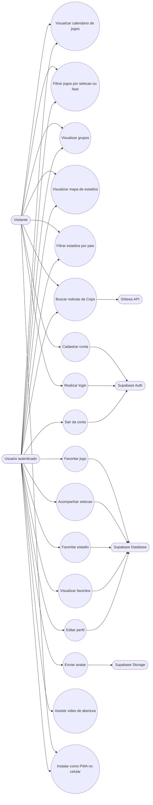

# Diagrama de Casos de Uso - Calendario da Copa 2026

Este documento descreve os principais atores e interacoes do sistema.

## Atores

| Ator | Descricao |
|---|---|
| Visitante | Pessoa que acessa o site sem estar autenticada. |
| Usuario autenticado | Pessoa cadastrada que pode salvar preferencias, favoritos e perfil. |
| Supabase Auth | Servico externo responsavel por login, cadastro e sessao. |
| Supabase Database | Servico externo responsavel pela persistencia de dados. |
| Supabase Storage | Servico externo responsavel pelo armazenamento de avatar. |
| GNews API | Servico externo usado para busca de noticias da Copa. |

## Diagrama em Mermaid

## Descricao dos principais casos de uso

### UC01 - Visualizar calendario de jogos
O usuario acessa a pagina principal e visualiza os jogos da Copa 2026 carregados a partir do arquivo `copa.json`.

### UC02 - Filtrar jogos
O usuario filtra partidas por selecao ou fase da competicao. O sistema atualiza a exibicao sem recarregar a pagina.

### UC03 - Cadastrar conta
O visitante informa e-mail e senha. O sistema usa Supabase Auth para criar uma nova conta.

### UC04 - Realizar login
O usuario informa suas credenciais. O Supabase Auth valida a sessao e o sistema libera recursos personalizados.

### UC05 - Favoritar jogo
O usuario autenticado seleciona a estrela de uma partida. O sistema salva ou remove o favorito no Supabase Database.

### UC06 - Acompanhar selecao
O usuario marca uma selecao na pagina de grupos. Os jogos dessa selecao passam a aparecer automaticamente destacados no calendario e na pagina de favoritos.

### UC07 - Favoritar estadio
O usuario seleciona um estadio no mapa e salva como favorito. O sistema grava o estadio no banco vinculado ao usuario.

### UC08 - Editar perfil e avatar
O usuario altera seus dados pessoais e pode enviar uma foto. Os dados ficam no Supabase Database e o avatar no Supabase Storage.

### UC09 - Buscar noticias
O usuario acessa a pagina de noticias. O sistema tenta buscar informacoes na GNews API e usa fallback local caso a API nao retorne resultados.

### UC10 - Instalar como PWA
O usuario acessa o site pelo celular e pode adiciona-lo a tela inicial, usando a estrutura de `manifest.json` e `service-worker.js`.

## Regras importantes

- Recursos de personalizacao exigem usuario autenticado.
- Um usuario so pode acessar seus proprios favoritos, perfil e preferencias.
- Caso a API de noticias falhe ou nao encontre resultados, o sistema usa noticias locais.
- O PWA depende de HTTPS para funcionar corretamente em producao.
