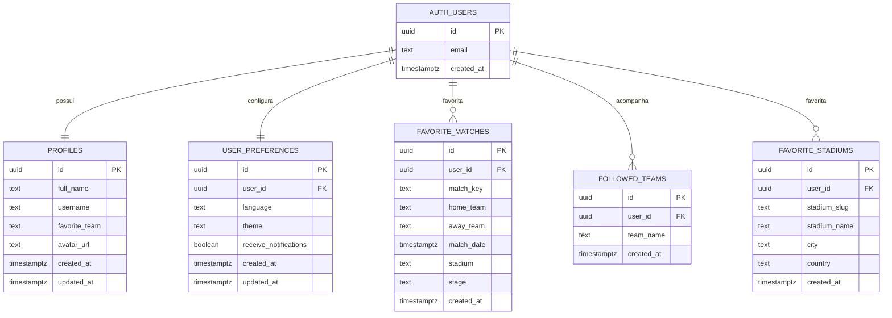

# DER — Modelo de Dados

Este documento descreve o modelo de dados usado no Supabase para o projeto Calendário da Copa 2026.

## Visão geral

O sistema usa o usuário autenticado pelo Supabase Auth como base para relacionar perfil, preferências, favoritos e seleções acompanhadas.

## Diagrama lógico

## Tabelas

### `profiles`

Armazena os dados principais do perfil do usuário.

| Campo | Tipo | Descrição |
|---|---|---|
| `id` | uuid | Mesmo ID do usuário autenticado |
| `full_name` | text | Nome completo |
| `username` | text | Nome de usuário |
| `favorite_team` | text | Seleção favorita |
| `avatar_url` | text | URL pública do avatar |
| `created_at` | timestamptz | Data de criação |
| `updated_at` | timestamptz | Data de atualização |

### `user_preferences`

Armazena preferências do usuário.

| Campo | Tipo | Descrição |
|---|---|---|
| `id` | uuid | Identificador da preferência |
| `user_id` | uuid | ID do usuário |
| `language` | text | Idioma escolhido |
| `theme` | text | Tema visual |
| `receive_notifications` | boolean | Preferência de notificações |
| `created_at` | timestamptz | Data de criação |
| `updated_at` | timestamptz | Data de atualização |

### `favorite_matches`

Armazena jogos favoritados manualmente pelo usuário.

| Campo | Tipo | Descrição |
|---|---|---|
| `id` | uuid | Identificador do favorito |
| `user_id` | uuid | ID do usuário |
| `match_key` | text | Chave única do jogo |
| `home_team` | text | Time mandante |
| `away_team` | text | Time visitante |
| `match_date` | timestamptz | Data e hora da partida |
| `stadium` | text | Estádio da partida |
| `stage` | text | Fase da competição |
| `created_at` | timestamptz | Data de criação |

### `followed_teams`

Armazena as seleções acompanhadas pelo usuário.

| Campo | Tipo | Descrição |
|---|---|---|
| `id` | uuid | Identificador |
| `user_id` | uuid | ID do usuário |
| `team_name` | text | Nome da seleção acompanhada |
| `created_at` | timestamptz | Data de criação |

### `favorite_stadiums`

Armazena os estádios favoritos do usuário.

| Campo | Tipo | Descrição |
|---|---|---|
| `id` | uuid | Identificador |
| `user_id` | uuid | ID do usuário |
| `stadium_slug` | text | Chave única do estádio |
| `stadium_name` | text | Nome do estádio |
| `city` | text | Cidade |
| `country` | text | País |
| `created_at` | timestamptz | Data de criação |

## Regras de integridade

- Cada usuário só acessa seus próprios dados.
- `favorite_matches` possui restrição única por `user_id` e `match_key`.
- `followed_teams` possui restrição única por `user_id` e `team_name`.
- `favorite_stadiums` possui restrição única por `user_id` e `stadium_slug`.
- As tabelas possuem Row Level Security para impedir acesso indevido.
