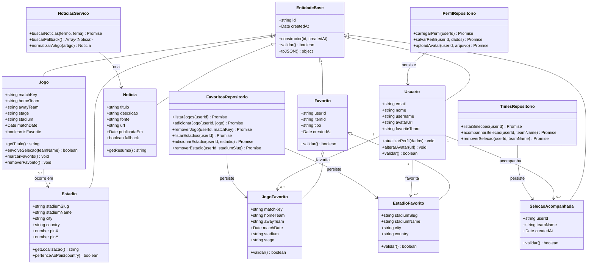

# Diagrama de Classes - Calendario da Copa 2026

Este documento apresenta uma proposta de classes para representar as principais entidades do sistema, seus atributos, metodos e relacionamentos. O projeto usa JavaScript puro, mas a modelagem foi organizada com base em Programacao Orientada a Objetos para deixar clara a estrutura interna da aplicacao.

## Diagrama em Mermaid

> O GitHub renderiza diagramas Mermaid automaticamente em arquivos Markdown.

## Como os principios de POO aparecem no projeto

### Encapsulamento
Cada classe concentra seus proprios dados e metodos. Por exemplo, a classe `Jogo` possui atributos como `homeTeam`, `awayTeam`, `stage` e metodos como `getTitulo()` e `envolveSelecao()`.

### Heranca
Classes como `Usuario`, `Jogo`, `Estadio`, `Noticia` e `Favorito` podem herdar de `EntidadeBase`, reaproveitando atributos comuns como `id`, `createdAt`, `validar()` e `toJSON()`.

### Polimorfismo
O metodo `validar()` pode existir em diferentes classes, mas cada uma valida suas regras de forma propria. Um `JogoFavorito` valida `matchKey`, enquanto um `EstadioFavorito` valida `stadiumSlug`.

### Abstracao
Classes como `PerfilRepositorio`, `FavoritosRepositorio`, `TimesRepositorio` e `NoticiasServico` escondem detalhes internos de comunicacao com Supabase, Storage, JSON local e API externa. A interface principal chama metodos de alto nivel sem precisar conhecer toda a logica interna.

## Observacao
A aplicacao atual usa modularizacao por arquivos JavaScript separados. A modelagem de classes documenta a estrutura orientada a objetos adotada e serve como base para evolucao do codigo, mantendo a separacao entre entidades, regras de negocio, persistencia e interface.
