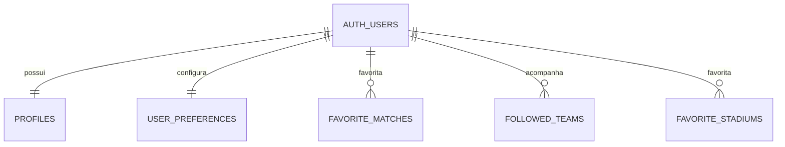

# Documentacao Tecnica - Primeira Versao

**Projeto:** Calendario da Copa 2026  
**Repositorio:** https://github.com/Joaop1901/copa26  
**Tipo:** Aplicacao Web responsiva com PWA e base Desktop com Electron  
**Versao:** 1.0 - Fase Tecnica inicial

---

## 1. Visao geral

O Calendario da Copa 2026 e uma aplicacao criada para acompanhar jogos, grupos, estadios, noticias e preferencias do usuario durante a Copa do Mundo de 2026. O sistema permite que usuarios facam login, acompanhem selecoes, favoritem jogos e estadios, editem perfil e consultem noticias.

A aplicacao foi desenvolvida com HTML, CSS e JavaScript puro, usando Supabase como backend em nuvem para autenticacao, banco de dados e armazenamento de avatar. O projeto tambem possui estrutura de PWA para funcionar como app instalavel no celular e uma base com Electron para versao desktop.

---

## 2. Objetivo do MVP

O MVP tem como objetivo entregar uma primeira versao funcional com as principais acoes do usuario:

- Visualizar calendario dos jogos.
- Filtrar jogos por selecao e fase.
- Fazer login e cadastro.
- Salvar jogos favoritos.
- Acompanhar selecoes.
- Exibir automaticamente jogos das selecoes acompanhadas.
- Favoritar estadios.
- Editar perfil e foto/avatar.
- Consultar mapa interativo dos estadios.
- Consultar noticias com fallback local.
- Rodar como PWA no celular.
- Possuir estrutura desktop com Electron.

---

## 3. Modelagem do banco de dados

A persistencia e feita com Supabase Database. O usuario autenticado pelo Supabase Auth e usado como base para relacionar perfil, favoritos e preferencias.

### Tabelas principais

| Tabela | Finalidade |
|---|---|
| `profiles` | Guarda dados do usuario, nome, username, selecao favorita e avatar. |
| `user_preferences` | Guarda preferencias como tema, idioma e notificacoes. |
| `favorite_matches` | Guarda jogos favoritados manualmente. |
| `followed_teams` | Guarda selecoes acompanhadas pelo usuario. |
| `favorite_stadiums` | Guarda estadios favoritos. |

### Relacionamentos principais



### Regras de banco

- Cada registro pertence a um usuario autenticado.
- O usuario so deve visualizar e alterar seus proprios dados.
- Jogos, selecoes e estadios favoritos devem ter restricoes para evitar duplicidade.
- O bucket `avatars` armazena imagens de perfil.

A estrutura SQL base esta no arquivo:

```txt
supabase/schema.sql
```

---

## 4. Diagrama de classes

O projeto possui uma camada de modelagem orientada a objetos representada pelas principais entidades do sistema. A implementacao pode ser encontrada no arquivo:

```txt
js/models.js
```

Resumo das classes principais:

| Classe | Responsabilidade |
|---|---|
| `EntidadeBase` | Classe base com atributos e metodos comuns. |
| `Usuario` | Representa o usuario autenticado e seus dados de perfil. |
| `Jogo` | Representa uma partida da Copa. |
| `Estadio` | Representa um estadio e sua localizacao no mapa. |
| `Noticia` | Representa uma noticia retornada pela API ou fallback. |
| `Favorito` | Classe base para itens favoritados. |
| `JogoFavorito` | Representa jogo salvo como favorito. |
| `EstadioFavorito` | Representa estadio salvo como favorito. |
| `SelecaoAcompanhada` | Representa uma selecao acompanhada pelo usuario. |

O diagrama completo esta em:

```txt
docs/DIAGRAMA_CLASSES.md
```

---

## 5. Casos de uso

A aplicacao possui dois atores principais: visitante e usuario autenticado. Tambem existem servicos externos que participam do fluxo, como Supabase Auth, Supabase Database, Supabase Storage e GNews API.

### Principais interacoes

| Ator | Acoes principais |
|---|---|
| Visitante | Ver calendario, grupos, estadios, noticias, cadastrar e fazer login. |
| Usuario autenticado | Favoritar jogos, acompanhar selecoes, favoritar estadios, editar perfil e avatar. |
| Supabase Auth | Validar login, cadastro e sessao. |
| Supabase Database | Salvar perfil, favoritos e selecoes acompanhadas. |
| Supabase Storage | Armazenar avatar. |
| GNews API | Retornar noticias quando disponiveis. |

O diagrama completo esta em:

```txt
docs/CASOS_DE_USO.md
```

---

## 6. Arquitetura do projeto

A arquitetura foi organizada em camadas simples:

```txt
Interface HTML
    ↓
Estilizacao CSS
    ↓
Logica JavaScript por pagina
    ↓
Modelos e entidades JS
    ↓
Supabase / JSON local / APIs externas
```

### Separacao de responsabilidades

| Camada | Arquivos | Responsabilidade |
|---|---|---|
| Interface | `*.html` | Estrutura visual das paginas. |
| Estilo | `css/*.css` | Aparencia, responsividade e identidade visual. |
| Logica de pagina | `js/index.js`, `js/grupos.js`, etc. | Controlar eventos, filtros e renderizacao. |
| Autenticacao | `js/auth.js`, `js/login.js` | Login, cadastro, sessao e logout. |
| Persistencia | `js/userData.js`, `js/supabaseClient.js` | Comunicacao com Supabase. |
| Modelos | `js/models.js` | Entidades e regras orientadas a objetos. |
| Dados locais | `copa.json` | Base de jogos da Copa. |
| PWA | `manifest.json`, `service-worker.js`, `js/pwa.js` | Instalacao mobile e cache. |
| Desktop | `desktop/main.js` | Inicializacao da janela Electron. |

---

## 7. Principios de Programacao Orientada a Objetos

### Encapsulamento

As classes concentram seus atributos e metodos. Por exemplo, `Jogo` possui os dados da partida e metodos como `getTitulo()` e `envolveSelecao()`.

### Heranca

`Usuario`, `Jogo`, `Estadio`, `Noticia`, `Favorito` e outras classes herdam de `EntidadeBase`, reaproveitando atributos como `id`, `createdAt`, `validar()` e `toJSON()`.

### Polimorfismo

Diferentes classes implementam o metodo `validar()` de maneiras diferentes. Um jogo valida seus times, enquanto um estadio valida nome, pais e slug.

### Abstracao

A aplicacao separa detalhes internos em servicos e repositorios. A interface nao precisa conhecer toda a logica de comunicacao com Supabase ou APIs externas.

---

## 8. Bibliotecas, servicos e versoes

| Nome | Versao/uso | Funcao |
|---|---|---|
| HTML5 | Padrao Web | Estrutura das paginas. |
| CSS3 | Padrao Web | Estilizacao e responsividade. |
| JavaScript | ES6+ | Logica do sistema. |
| `@supabase/supabase-js` | v2 via CDN | Auth, Database e Storage. |
| Supabase Auth | Servico externo | Login, cadastro e sessao. |
| Supabase Database | PostgreSQL gerenciado | Persistencia de dados. |
| Supabase Storage | Bucket `avatars` | Upload de avatar. |
| GNews API | REST API | Noticias da Copa. |
| PWA APIs | Browser APIs | Manifest, service worker e cache. |
| Electron | `^31.0.0` | Base da versao desktop. |
| Netlify | Hospedagem estatica | Deploy da versao web. |

Observacao: a biblioteca Supabase esta referenciada como `@supabase/supabase-js@2`, carregada por CDN.

---

## 9. Estrutura de pastas e arquivos

```txt
.
├── css/                  # Estilos por pagina
├── docs/                 # Documentacao tecnica
├── img/                  # Imagens e icones
├── js/                   # Scripts da aplicacao
├── desktop/              # Base da aplicacao desktop Electron
├── supabase/             # Script SQL do banco
├── video/                # Video de abertura
├── copa.json             # Base local dos jogos
├── index.html            # Pagina principal/calendario
├── login.html            # Login e cadastro
├── grupos.html           # Grupos e selecoes
├── estadios.html         # Mapa de estadios
├── favoritos.html        # Favoritos do usuario
├── perfil.html           # Perfil e avatar
├── noticias.html         # Noticias
├── manifest.json         # Configuracao PWA
├── service-worker.js     # Cache do PWA
└── README.md             # Apresentacao do projeto
```

---

## 10. Instrucoes de execucao

### Rodar a versao web localmente

1. Abrir o projeto no Visual Studio Code.
2. Instalar a extensao Live Server.
3. Clicar com o botao direito em `index.html`.
4. Selecionar **Open with Live Server**.

URL local esperada:

```txt
http://127.0.0.1:5500/index.html
```

### Rodar a versao desktop

```bash
cd desktop
npm install
npm start
```

### Publicar no Netlify

Configuracao recomendada:

```txt
Branch: main
Base directory: vazio
Build command: vazio
Publish directory: .
```

---

## 11. Tratamento de erros

O projeto possui tratamentos basicos para:

- Erro de login ou cadastro.
- Sessao inexistente.
- Falha ao buscar noticias na API.
- API sem resultados, ativando fallback local.
- Falha ao carregar dados do Supabase.
- Bloqueio de autoplay do video de abertura, abrindo modo mudo.
- Service worker ignorando videos e audios para evitar erro de cache com resposta parcial `206`.

---

## 12. Commits e evolucao incremental

O repositorio deve conter ao menos 5 commits significativos. Uma evolucao recomendada e:

1. Estrutura inicial do projeto.
2. Implementacao de login/cadastro e Supabase.
3. Implementacao do calendario, filtros e favoritos.
4. Implementacao de grupos, estadios e perfil.
5. Adicao de noticias, PWA, documentacao e ajustes finais.

Um arquivo auxiliar com sugestao de commits esta em:

```txt
docs/COMMITS.md
```

---

## 13. Referencias tecnicas

- Documentacao do Supabase: https://supabase.com/docs
- Documentacao do Electron: https://www.electronjs.org/docs/latest
- Documentacao sobre PWA: https://developer.mozilla.org/docs/Web/Progressive_web_apps
- Documentacao do Netlify: https://docs.netlify.com
- Documentacao do GitHub: https://docs.github.com
- GNews API: https://gnews.io/docs

---

## 14. Conclusao

A primeira versao tecnica do projeto atende ao objetivo principal de criar uma plataforma funcional para acompanhamento da Copa 2026. O sistema possui interface grafica, autenticacao, banco de dados, storage, favoritos, mapa interativo, noticias, PWA, base desktop, documentacao e repositorio publico no GitHub.

Os proximos passos sao aprimorar a aplicacao mobile, gerar instaladores desktop e evoluir a arquitetura com uma API REST propria, se necessario.
